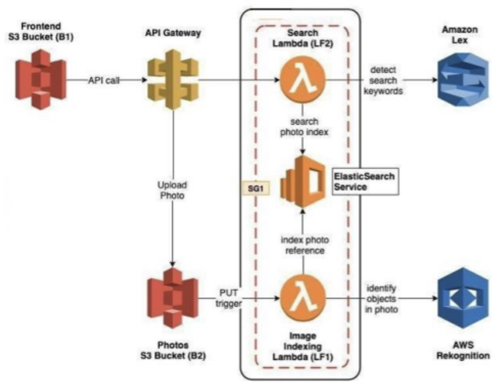

# Intelligent Photo Album Web Application

This repository contains a **Photo Album Web Application** that enables users to search for photos using **natural language queries**. The application leverages **AWS Rekognition** for image analysis, **ElasticSearch** for indexing and searching, and **AWS Lambda** for serverless processing. It also features an intuitive frontend for uploading and searching photos.

## Features

- **Photo Uploads**: Store photos in S3 and append custom labels via metadata.
- **Natural Language Search**: Query photos using keywords or phrases like "show me photos with cats and dogs."
- **Image Analysis**: Automatically detect labels (e.g., objects, actions, landmarks) in uploaded photos using AWS Rekognition.
- **Scalable Architecture**: Built with AWS Lambda, API Gateway, S3, ElasticSearch, and CloudFormation for a robust and scalable infrastructure.
- **DevOps Integration**: Automatic deployment pipelines using AWS CodePipeline.

## Project Workflow

### 1. Photo Upload and Indexing

- **S3 Bucket**: Photos are uploaded to an S3 bucket (`B2`).
- **Lambda Function (LF1)**: A PUT event triggers `index_photos.mjs`, which:
  - Analyzes the photo with AWS Rekognition to generate labels.
  - Adds custom labels from the photo metadata (`x-amz-meta-customLabels`).
  - Indexes the photo data into ElasticSearch.

### 2. Natural Language Search

- **Amazon Lex Bot**: Handles natural language queries via the `SearchIntent`.
- **Lambda Function (LF2)**: The `search_photos.mjs` Lambda processes search queries:
  - Extracts keywords using Lex.
  - Queries the ElasticSearch instance (`photos` index) for matching photos.
  - Returns search results to the user.

### 3. API Layer

- **API Gateway**:
  - `PUT /photos`: Proxy request to S3 for photo uploads.
  - `GET /search?q={query text}`: Invokes `search_photos.mjs` to fetch search results.
- **API Key**: Secures API access.

### 4. Frontend

- A simple web application hosted on an S3 bucket (`B1`) that:
  - Uploads photos via the `PUT /photos` endpoint.
  - Allows users to add custom labels during upload.
  - Displays search results from the `GET /search` endpoint.

### 5. Deployment

- **AWS CodePipeline**:
  - `P1`: Deploys Lambda functions.
  - `P2`: Deploys frontend files to the S3 bucket.
- **CloudFormation Template**:
  - Automates infrastructure setup (Lambdas, API Gateway, S3 buckets).

## Getting Started

### Prerequisites

- **AWS Account** with permissions for S3, Lambda, API Gateway, Rekognition, ElasticSearch, and CodePipeline.
- **Node.js** installed for local development.
- **ElasticSearch Instance**: Create a domain called `photos`.

### Setup Steps

#### 1. ElasticSearch Instance

- Launch an ElasticSearch domain named `photos`.

#### 2. S3 Buckets

- Create:
  - A bucket (`B1`) for hosting the frontend.
  - A bucket (`B2`) for storing photos.

#### 3. Lambda Functions

- Deploy `index_photos.mjs` and `search_photos.mjs`.
- Set up triggers:
  - `index_photos.mjs` triggers on photo uploads to `B2`.
  - `search_photos.mjs` connects to the `GET /search` endpoint.

#### 4. API Gateway

- Create API methods:
  - **PUT /photos**: Proxy to S3 for uploads.
  - **GET /search**: Connect to `search_photos.mjs`.

#### 5. Frontend

- Host the frontend on `B1`:
  - Include upload and search functionality.
  - Integrate the API Gateway SDK for communication.

#### 6. Deployment

- Configure CodePipeline:
  - `P1`: Automates Lambda deployments.
  - `P2`: Automates frontend deployment.

#### 7. CloudFormation Template

- Use `cloudformation.yaml` to deploy core resources (S3 buckets, Lambdas, API Gateway).

## Running the Application

1. **Upload Photos**: Use the frontend or `PUT /photos` API.
2. **Search Photos**: Query using natural language via the frontend or `GET /search` API.
3. **View Results**: See matching photos with detected and custom labels.

## Technologies Used

- **AWS Services**: S3, Lambda, Rekognition, ElasticSearch, API Gateway, CodePipeline, CloudFormation.
- **Frontend**: Static website hosted on S3, integrated with the API Gateway SDK.
- **DevOps**: Continuous delivery pipelines for backend and frontend code.

## License

This project is licensed under the MIT License. See the `LICENSE` file for details.
